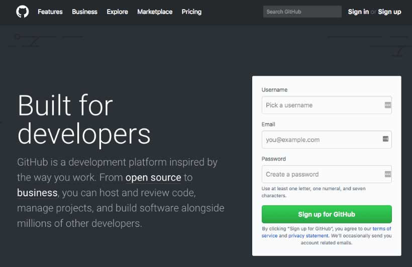
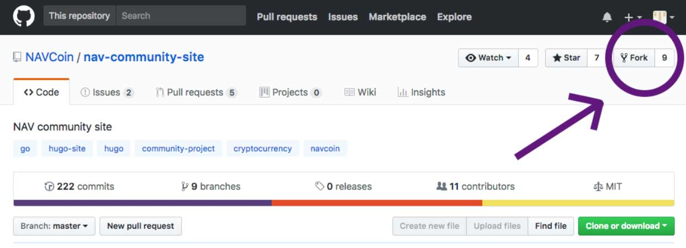
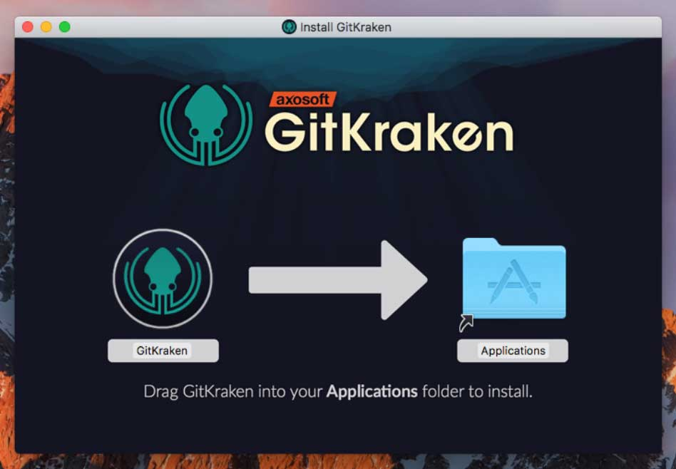
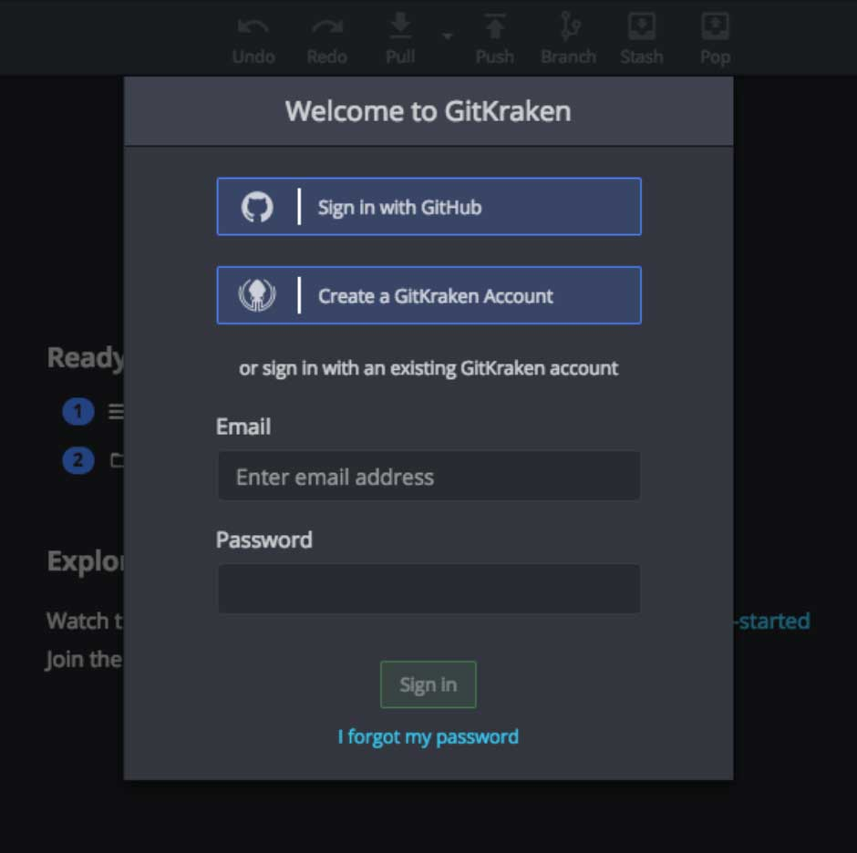
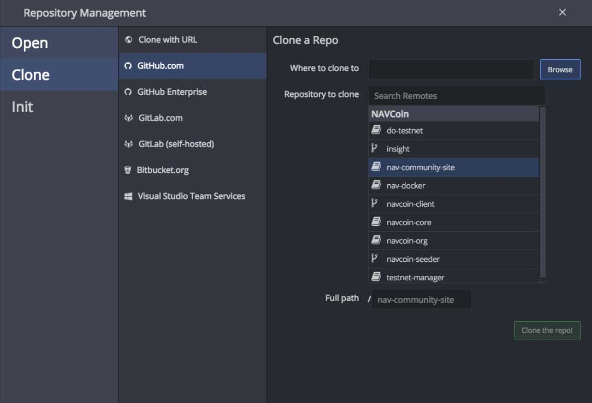
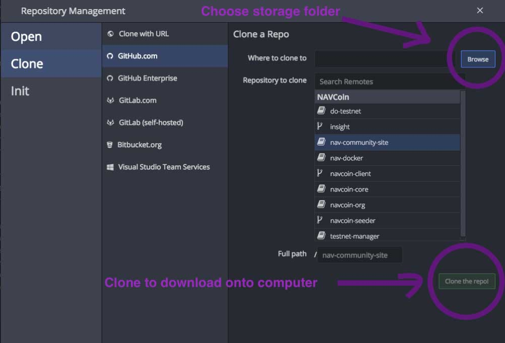

### Getting started with GitHub
First you need to sign up on [www.github.com](http://www.github.com), if you haven't already. Just visit the website and fill in the sign up form on the frontpage.

<figure style="padding: 20px 0 20px 0; background-color: #fff">
  
</figure>

Once you've created an account, sign in and visit [www.github.com/NAVCoin/nav-community-site](http://www.github.com/NAVCoin/nav-community-site).
From GitHub, click the "Fork" button on the right side of the page to create your open copy of the website code that you can edit.

<figure style="padding: 20px 0 20px 0; background-color: #fff">
  
</figure>

Now that you have your own copy, we need to get it so you can edit it, so visit [https://www.gitkraken.com/download](https://www.gitkraken.com/download) and download the version of GitKraken that matches your computer (Windows, MacOS, Linux).

<figure style="padding: 20px 0 20px 0; background-color: #fff">
  
</figure>

GitKraken will let you download and manage the website code.

Once the download is complete, install GitKraken and then open it.

<figure style="padding: 20px 0 20px 0; background-color: #fff">
  
</figure>

Inside GitKraken we'll need to click the "Sign in with GitHub" button to log into your account.

<figure style="padding: 20px 0 20px 0; background-color: #fff">
  
</figure>

Now that you are signed in we need to click the folder icon in the top left corner.
Next click "Clone" and then "GitHub.com".

If your account is new you should only see the nav-community-site listed otherwise you'll see a list of all the things you have on GitHub.

<figure style="padding: 20px 0 20px 0; background-color: #fff">
  
</figure>

Click on "nav-community-site" and then click the "browse" button. You can now choose where on your computer you want to store the website code. Somewhere like your "Documents" folder (MacOS) or "My Documents" folder (Windows) is fine.

Next click the "clone button" and the code will be downloaded to your computer.

<figure style="padding: 20px 0 20px 0; background-color: #fff">
  
</figure>

Congrats, you've completed Tutorial 1, have some more coffee or tea and continue to [Tutorial 2](/how-to-guide/tutorial-2/)
