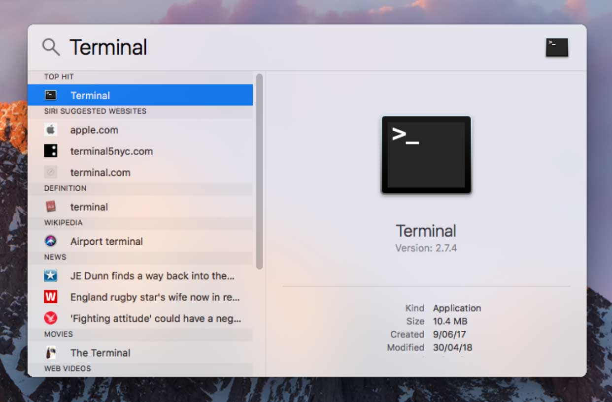

### How to preview the website on your computer (MacOS)

For this tutorial we'll assume you have completed the [previous tutorial](/how-to-guide/tutorial-1/).

1: First up we need to install a package manager, this lets you install software on your computer easily. Press Command + Spacebar to open Spotlight, and type "Terminal" and press enter.
This will open a command line window.

<figure style="padding: 0 0 5px 0; background-color: #fff">
  
</figure>

We will install a package manager called "Home Brew".
To install Home Brew, copy this command and paste it into the command line window:

`/usr/bin/ruby -e "$(curl -fsSL https://raw.githubusercontent.com/Homebrew/install/master/install)"`

### Homebrew install instructions

Goto [brew.sh](http://brew.sh)

Follow the onscreen instructions and Home Brew will install.
Close the terminal window.
Press Command + Spacebar to open Spotlight, and type "Terminal" and press enter to open a new terminal window.

Type:
`brew install hugo`

Installing Brew: [screencast](https://asciinema.org/a/IHLqYujlrckNO5vRqnHzZwNjq)

This will install the software to preview the NavCoin community site on your computer.
Next we need to go to the folder you saved the community site to using Git Kraken.

If you saved it to Documents, in your terminal type:

`cd ~/documents/nav-community-site/`

If you had saved it somewhere else then you'll need to type it out:

`cd [replace this with the folder path to your folder]/nav-community-site`

Once you've done that, in your terminal type:

`hugo server`

To see an example of the commands being run, watch these.

Running from Documents: [screencast](https://asciinema.org/a/180120)

Running from another folder: [screencast](https://asciinema.org/a/Hb5FRZWD7yLAMxWzdVithqmCk)

Then open your web browser and go to [http://localhost:1313](http://localhost:1313) to view your version of the NAV Community Site.

Congrats, you've completed Tutorial 2, make sure to stretch and continue to [Tutorial 3](/how-to-guide/tutorial-3/)
