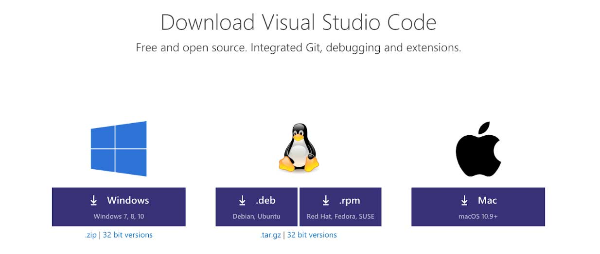
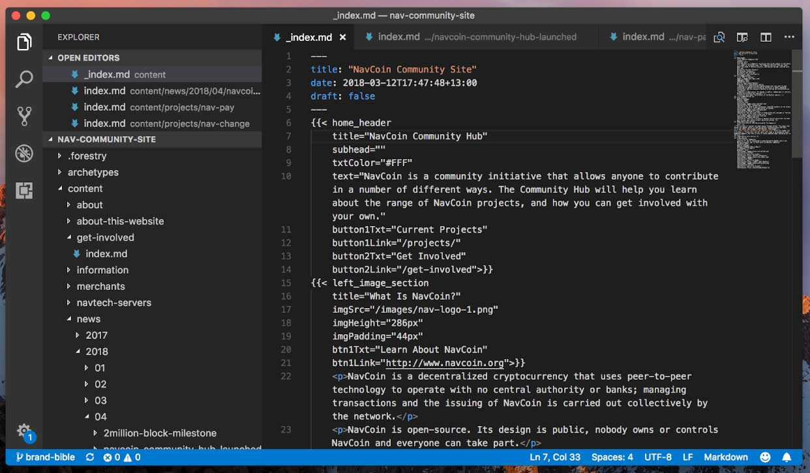
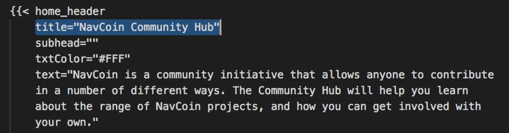
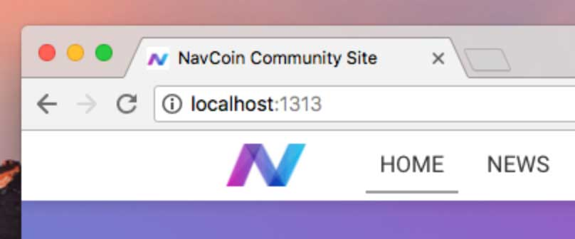
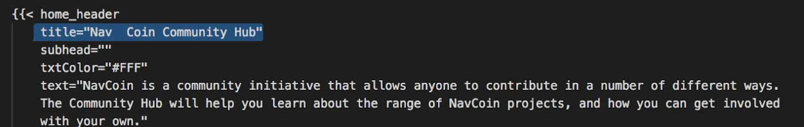
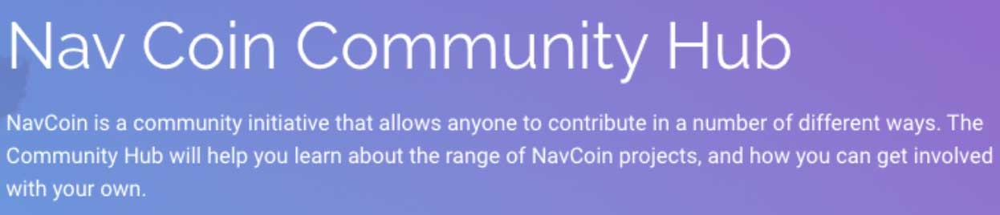
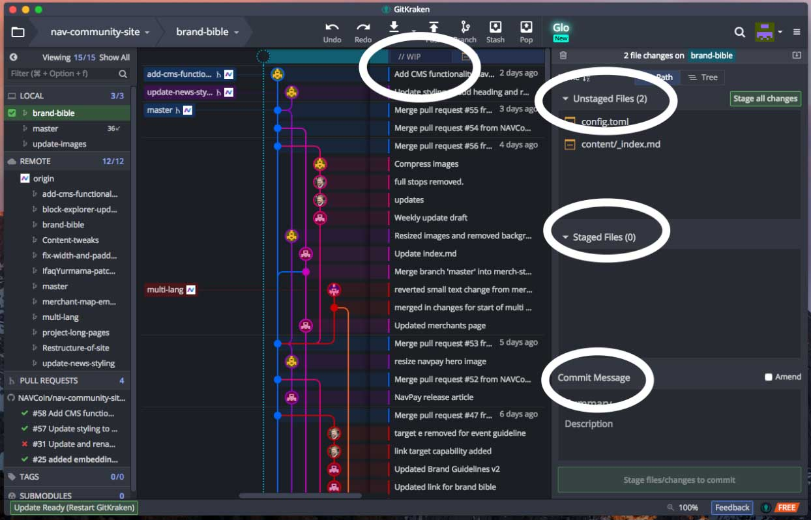
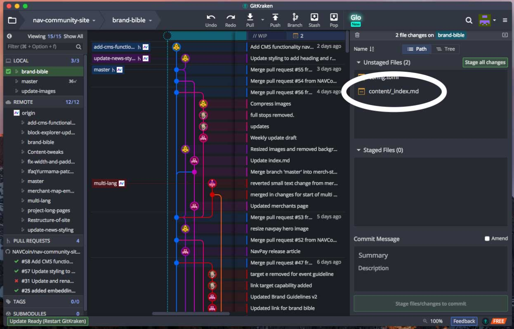
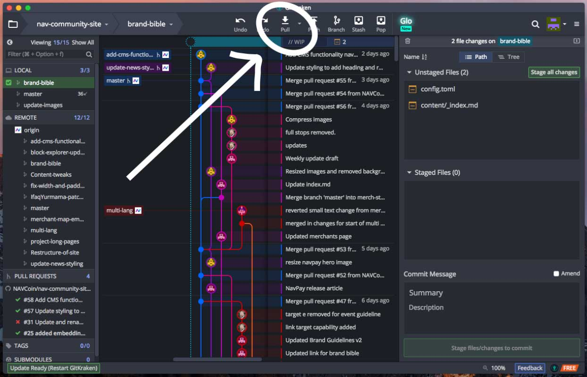

### How to make a basic edit of existing content

Assuming you've completed the [previous tutorial](/how-to-guide/tutorial-2), we're going to get started on how to make a simple edit to a page that already exists on the website. Maybe you found a typo or just want to tweak the wording of something.

First we're going to need a text editor, I recommend using Visual Studio Code because it has "Syntax Highlighting" when means it will highlight the website's code in a way that makes it easier to read.

Visit https://code.visualstudio.com/download and then download and install VS Code.

<figure style="padding: 20px 0 20px 0; background-color: #fff">
  
</figure>

Next open VS Code and in the toolbar click File and then Open.
Browse to where you saved the NAV Community Site (for example Documents/nav-community-site) and inside that folder go into the Content folder. This is where we keep all the pages for the website.

Since this is just a simple example, we'll edit the front page; So double click on the file called **_index.md** inside the content folder.

This will open the page's code inside VS Code. Now you should see some blocks of text on the page text like this:

<figure style="padding: 20px 0 20px 0; background-color: #fff">
  
</figure>

These are called "Shortcodes" and are little templates that we use to create content on the website.

To show you how it works, just edit the first shortcode where it says
`title="NavCoin Community Hub"`

Change the title to say whatever you want, save your changes (in the toolbar click **File** and then click **Save**) and then we will preview your changes.
Make sure that you keep the quotes " " around your text and don't delete the **title=** either.

<figure style="padding: 20px 0 20px 0; background-color: #fff">
  
</figure>

To preview your changes open your terminal again (Press Command and the Spacebar at the same time, type terminal and then press Enter).
Watch these to see how to run the website.

Running Hugo from Documents: [screencast](https://asciinema.org/a/180120)

Running Hugo from another folder: [screencast](https://asciinema.org/a/Hb5FRZWD7yLAMxWzdVithqmCk)

Once you've run the commands, without closing the terminal, open your web browser and visit [http://localhost:1313](http://localhost:1313)

<figure style="padding: 20px 0 20px 0; background-color: #fff">
  
</figure>

This will load up your version of the website, and you should be able to see your changes you made to the title of the first piece of content on the page.

Go back into Visual Studio Code and in the same file as before, make another change to the **title**, and save it.
If you look at your web browser, it should automatically update the page to show your new change. This applies to `.html`, `.css`, and `.md` files.

<figure style="padding: 20px 0 20px 0; background-color: #fff">
  
</figure>

`command save (CMD + S)`

<figure style="padding: 20px 0 20px 0; background-color: #fff">
  
</figure>

When you are happy with your change, we'll save it with GitKraken so you can upload it to GitHub (you will need to do this to make actual changes to the real nav community site).

Open GitKraken on your computer.
Near the top of the window underneath the buttons **Undo Redo Pull Push Branch Stash Pop** you should see a row on the screen with a text box that says:

`// WIP`

Click on that row and on the right side of the screen you will see three boxes with the labels:

**Unstaged Files**

**Staged Files**

**Commit Message**

<figure style="padding: 20px 0 20px 0; background-color: #fff">
  
</figure>

Unstaged files are files that you have changed, but haven't selected to "Commit" to GitHub.
There should be a file in that box called **content/_index.md**, this is the that file for the frontpage that we have just changed.

<figure style="padding: 20px 0 20px 0; background-color: #fff">
  
</figure>

Hover your mouse over it, and click the button **Stage File** that appears next to it.

Your file is now **Staged** meaning it is ready to be "Committed" to GitHub.

Next click in the **Commit Message** box. This is where you type a message about the changes you have made. For example we can type "Changed the title of the home header on the front page".

After that click on the button below, **Commit changes to 1 file**.

This will commit your changes, but before they will appear on GitHub you will need to click the **Push** button at the top of your screen.

Now if you visit your GitHub page for the website:

<figure style="padding: 20px 0 20px 0; background-color: #fff">
  
</figure>

e.g. `www.GitHub.com/your-username-here/nav-community-site`

And it will show the latest commit as the one you just "Pushed" up to GitHub.

Congrats, you've completed Tutorial 3, make sure to stretch and continue to [Tutorial 4](/how-to-guide/tutorial-4/)