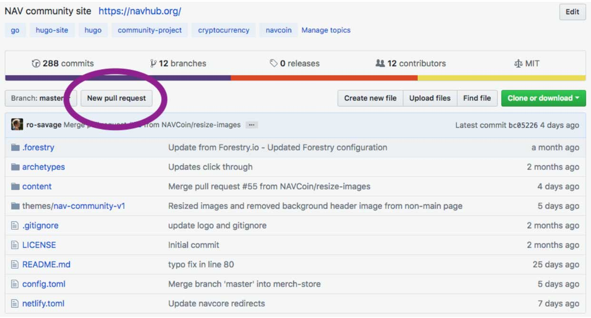
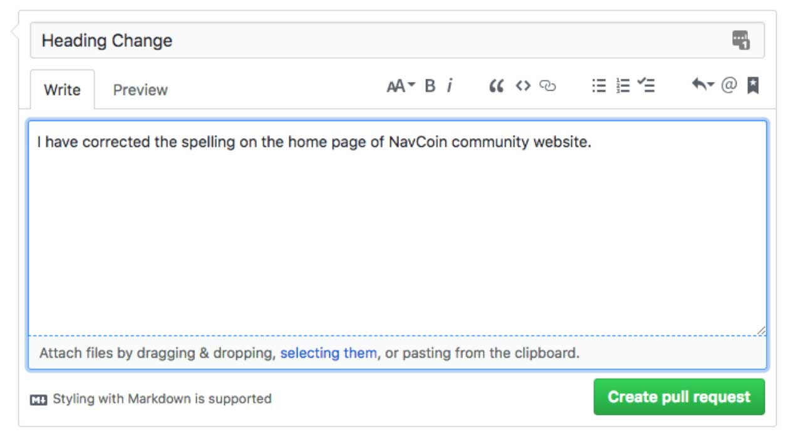

### How to create a Pull Request (Get your changes added to the community site)

Assuming you've completed the previous tutorials and have pushed a change you've made to GitHub, now we'll go through the process of creating a pull request for the nav-community-site.

Open GitHub and navigate to your repository:
e.g. `https://www.GitHub.com/[your-user-name]/nav-community-site`

There is a button that says "New Pull Request" about 1/3rd down the page.
Click it to begin creating a pull request, your web browser will go to a new page.

<figure style="padding: 20px 0 20px 0; background-color: #fff">
  
</figure>

Below the title "Comparing Changes" are some small drop down menus.
It should automatically select the right settings, but just to be sure (from left to right) it should read:

"Base Fork: NAVCoin/nav-community-site"

"Base: Master" "Head Fork: [your-user-name/nav-community-site"

"Compare: Master"

If these settings are incorrect, change them to match the above, otherwise click "Create New Pull Request"

<figure style="padding: 20px 0 20px 0; background-color: #fff">
  
</figure>

This will create a request to have your changes merged into the live NavCoin Community Site.

Before your changes can be merged at least three community members will need to review your changes and "Approve" them.

They may comment and discuss your changes, and perhaps suggest things like tweaks to wording or fixes for typos.

If you need to make changes, simply make the edit on with Visual Studio Code like we did in the previous tutorial. Save them, and then using GitKraken, create a new commit and "push" the commit up to GitHub.

After 3 approvals have been reached you can "Merge" your pull request to the NavCoin Community Website by clicking the "Merge Pull Request" button near the bottom of the page.

Congrats, you've completed Tutorial 4, take a big break and proceed to [Tutorial 5](/how-to-guide/tutorial-5/)

