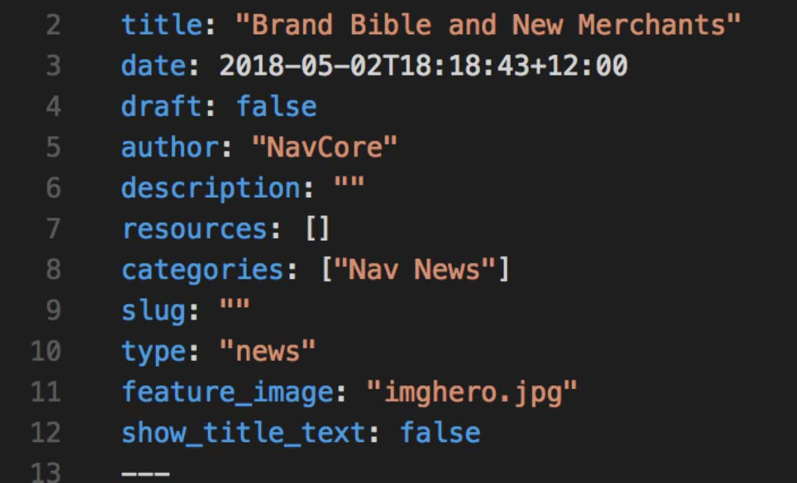
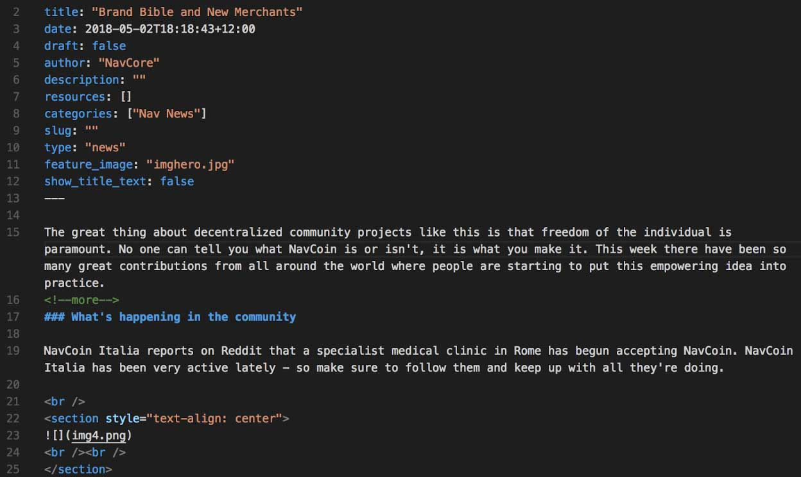
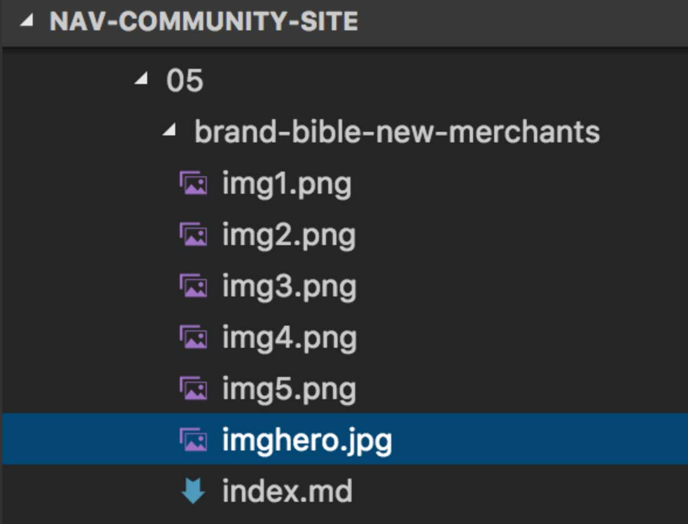

### How to add a news post

First we will assume you have both read the previous tutorials and have your piece of news already written.

Your news article will also need to be written in markdown format. Explaining how Markdown works is outside the scope of this tutorial, but there are many existing tutorials on how to use Markdown on the internet.

Next we need create a folder for the article in Visual Studio Code, the folder will depend on the date of publication; for this example we'll say the 28th of May 2018.

Inside the **content** folder open the **news** folder. There is already a **2018** folder, but if there wasn't we would create one. Open it up and inside we would do the same, there is already an **05** folder for May, but if there wasn't we would create one. Open up the **05** folder and inside create a folder with the title of your article, for example "example-news-article". Notice that we need to make the folder name all in lowercase and with dashes instead of spaces.

Next open Visual Studio Code. Open your news article's markdown file and also open an existing news item from the community site. For this example we'll open the other news from May, under `content/news/05/brand-bible-new-merchants/index.md`.

Create a new file in Visual Studio Code and past the top part of the brand-bible-new-merchants/index.md file into it. All we want is this part:
```
---
title: "Brand Bible & New Merchants"
date: 2018-05-02T18:18:43+12:00
draft: false
author: "NavCore"
description: ""
resources: []
categories: ["Nav News"]
slug: ""
type: "news"
feature_image: "imghero.jpg"
show_title_text: false
---
```

<figure style="padding: 0 0 10px 0; background-color: #fff">
  
</figure>

We need to edit a few lines in this, the title, date, author and feature_image.

The **title** put your article's title, make sure to add quotes to the start and end, like this: "example title"
For the **date** all you need to write is the day in the format: YYYY-MM-DD (Year-Month-Day) You don't need quotes for this one.
**author** needs to have quotes around it like title: e.g. author: "Satoshi Nakamoto"
**feature_image** is the image that will show as a thumbnail when people are browsing the news section on the Nav Community Site, just make this the name of what your feature image will be, it will need quotes around it too.

Next copy your news article and paste it into the new file we're making, underneath the --- of the first section.

<figure style="padding: 20px 0 20px 0; background-color: #fff">
  
</figure>

Save this file under `news/content/2018/05/[your-folder]/` as **index.md**

Next make sure your image for your article is saved in the same folder, with the same name that you used for the **feature_image** field.

<figure style="padding: 20px 0 20px 0; background-color: #fff">
  
</figure>

After all of this is done, you'll need to open GitKraken and commit your changes like we did in the previous tutorial. Push your changes up, create a pull request, and after your article has been merged it'll appear in the news section of the website.
