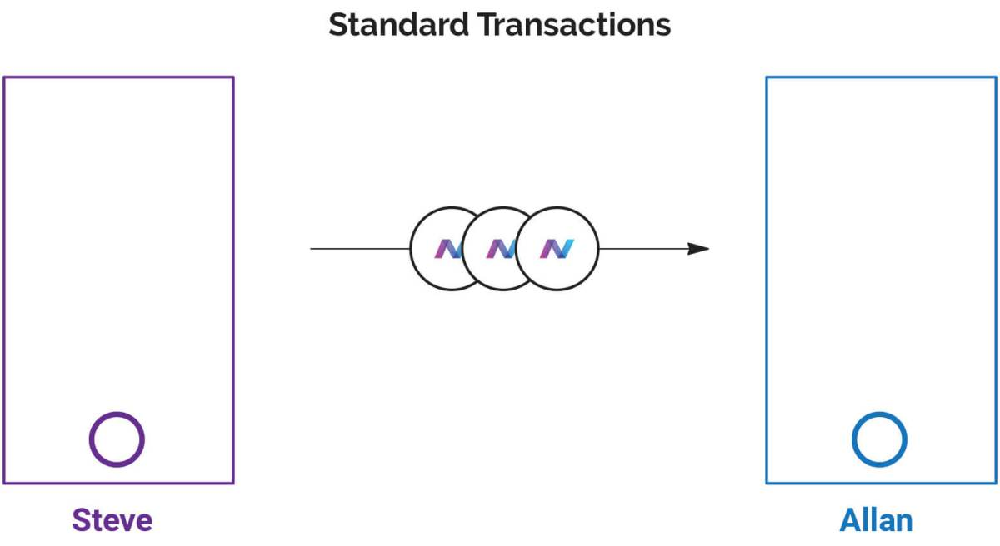
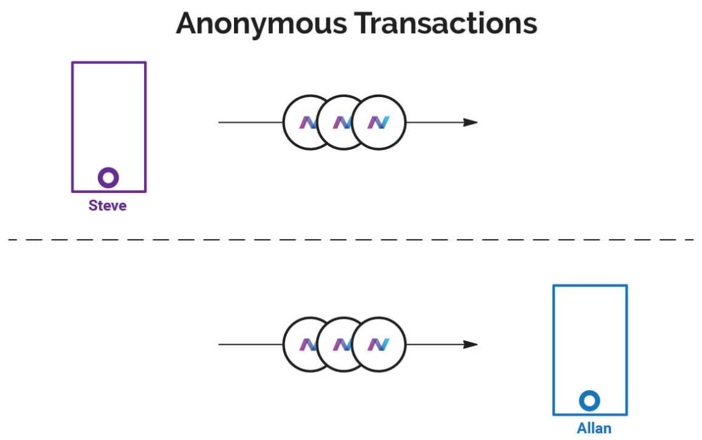
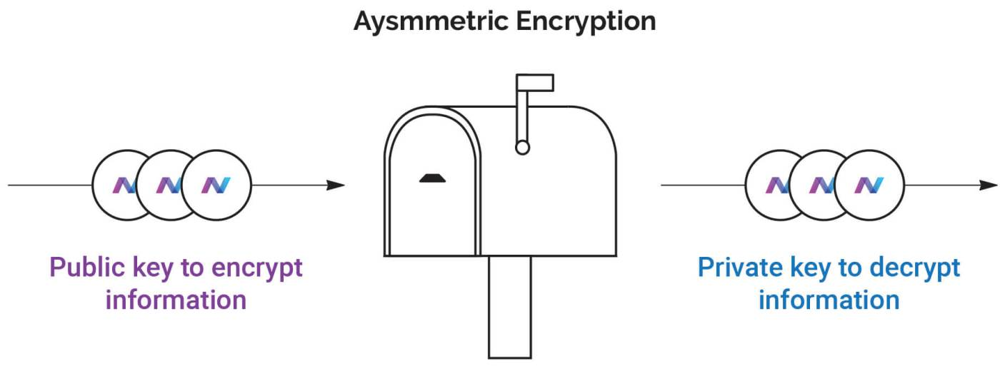
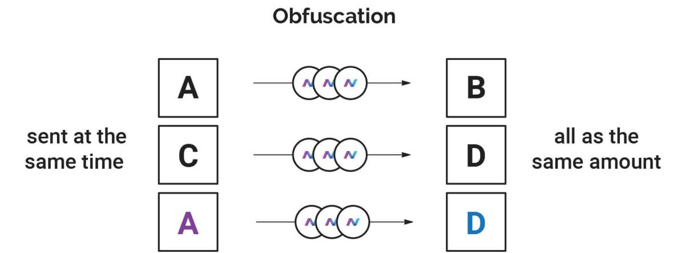
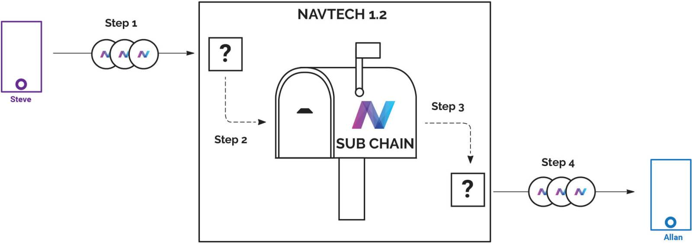
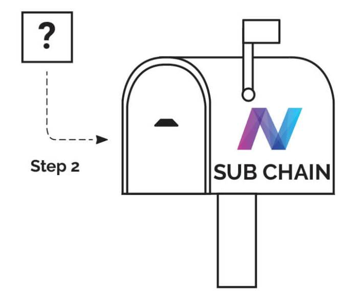
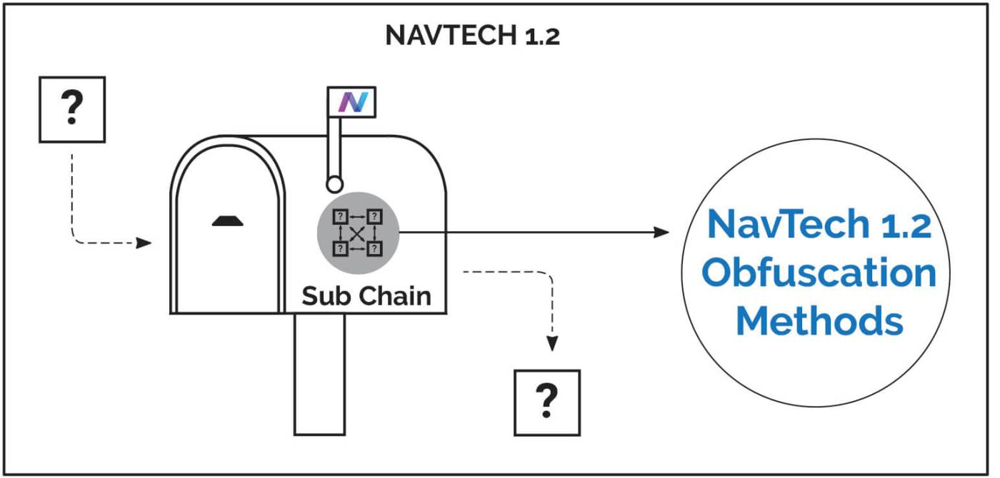
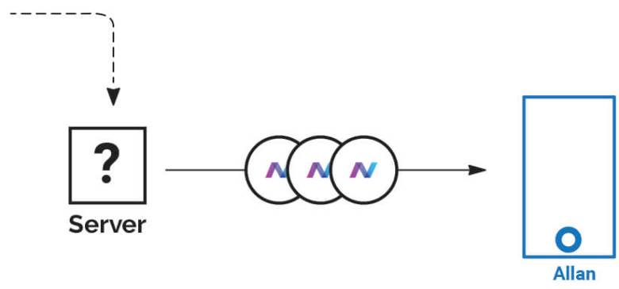
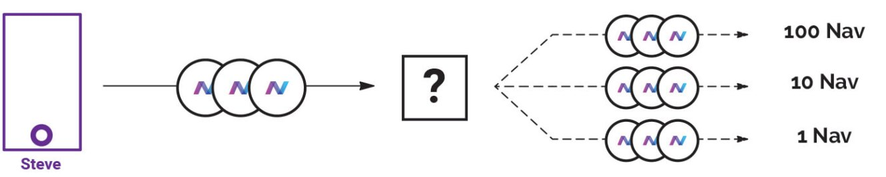
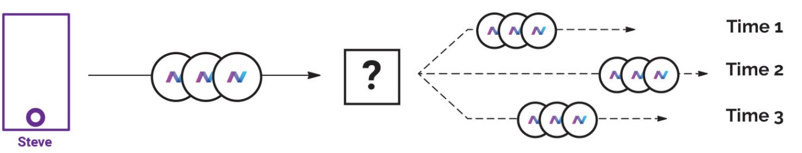

With the release of NavTech 1.2, we’re making a lot of improvements to make sure that your transactions are safer, more secure, and more private than ever before. So we thought we would take this time to step back and talk about why privacy is important, how privacy in cryptocurrencies work, and how NavTech (Nav Coin’s optional private payment) works.
<!--more-->

### Why privacy is important
Privacy, in the form of encryption, is what allows transactions on the internet to exist. A secure network means you can send payments from one party to another, without having your money get stolen, or your information intercepted, along the way.

But privacy is about more than just securing your sensitive information. It’s about controlling your information, so that you can choose what to share, and with whom.

Information is power, and the more that is known about your day-to-day life (your beliefs, your connections, who you support), the more power can be held over you – by corporations, governments, hackers, or even just people who dislike you.

To this, some people say “Hey, I’ve got nothing to hide, so I’ve got nothing to fear!”. While this is an understandable attitude, as most people are law-abiding, it’s misguided. To anyone who says that they’ve got nothing to gain from privacy, we suggest a thought experiment:

Imagine if everyone could type in your name and see every website you’ve ever visited, all your bank transactions and any private conversations you’ve had. I would bet that you’ve said things about people that would hurt their feelings, visited websites that your significant other might not approve of, as well as given up so much information that hackers/stalkers/enemies will be able to use against you. It would be hugely damaging to your social identity. This is why privacy is important for everyone, especially the law-abiding, and shouldn’t be taken for granted. And it’s why we think that the more privacy you can choose to exert over your affairs, the better it is for everyone.

Better privacy is a safeguard against a future that is unknowable. There is an immense amount of data in the blockchain, and as the industry grows with ever more payment/app information, there is a considerable incentive for big companies (such as Google & Facebook) to get involved and track even more of your personal data. Blockchain analysis tools are getting more advanced by the day, and political situations in countries will never stay static. The future is impossible to predict, which is why Nav Coin believe’s that the default state of your information should be one that protects you.

### What makes a good privacy coin?
NavCoin is a cryptocurrency that falls under the category of “privacy coin”. The idea behind Nav Coin is to make transactions as private as possible, much more so than a normal cryptocurrency where the ledger and all transactions, despite being controlled by cryptography, are technically viewable by the public – and so are vulnerable to blockchain analysis.

Here’s an example. A normal cryptocurrency transaction contains information such as the recipient, the sender, and the amount transferred. It looks like this:

A private transaction goes to extra effort to hide and/or obscure this information so that outside observers, and receivers, can’t see who sent the transactions.

The trick is to sever the link between the sender and the recipient’s wallets. Different cryptocurrencies accomplish this in two key ways.

#### Encryption
This is basically where you take information and mathematically combine it with a password – a process called “hashing.” Anyone who looks at the information without the password will only see gibberish. But anyone with the password can reverse the encryption to reveal the original message.

All cryptocurrencies, including the original Bitcoin, make use of encryption in some form. They are generally based on “asymmetric” encryption, which is exactly what it sounds like (“asymmetric” meaning one-sided). Only one person can decrypt the message to see what it contains. Think of it like a mailbox that has two openings, one for putting letters in and one for taking them out.

You hand out keys to people you trust, and this allows them to drop a message into your mailbox. But only you can open the mailbox to see what’s inside – with your own private key. In encryption, this key is your private password or passphrase.

#### Obfuscation
Encrypting information is only one part of the puzzle. To make a true privacy coin, obfuscation is required. The idea is hiding/disguising how something is being run, so there’s no way to know what’s going on inside. The goal is to make something that works seamlessly for senders and receivers, but to outside observers is so complex, messy and opaque that if a third party were to try and analyse your software or transactions in an attempt to look for patterns, they’d have a very hard time.

What does this look like? Let’s use this image as an example:

If you notice that a private payment was sent from Wallet A to Wallet B, and at the same time Wallet C sent a private payment to Wallet D – if both of these are the same NAV amount, and happen at the exact same time, then you could logically connect the addresses together. With obfuscation enabled, the system will be messy with different amounts being sent at different times, and hidden amongst random signals (transactions), so that you can’t reliably connect Wallet A to Wallet D.

### What is NavTech?
NavTech is an optional, private “send” for the Nav Coin cryptocurrency (NAV) that we use to send transactions that are both encrypted and obfuscated. There’s a transaction cost of 0.5% NAV to use NavTech to send Nav Coin. Normally, transactions cost 0.0001 NAV (equivalent to approximately $0.00004 USD).

### Here’s how it works step-by-step
### A normal transaction
The standard form of transaction in Nav Coin (and most other cryptocurrencies) is simple – the transaction is added into the blockchain, and the amount sent appears in the receiving wallet once it is confirmed. There’s other stuff that goes on behind the scenes, but that’s how the transaction appears to other parties.

### An anonymous transaction
Because blockchains record all transactions, for an anonymous transaction to take place on a blockchain-based cryptocurrency, it’s necessary to completely break the link between sender and receiver. Essentially, one party sends coins to one address, and a completely different wallet sends to the receiving address – with no visible link in the middle.

### So how does NavTech do this?
NavTech introduces a second blockchain, which is completely separate from the original NavCoin blockchain. We call this the “sub-chain.”

When someone uses NavTech to send coins, the sender fires off their transaction to a NavTech server instead of to the intended destination. The intended destination wallet address is encrypted into the transaction so that only the NavTech server can read it.
A NavTech server is a special kind of wallet that processes anonymous transactions, and anyone is able to set one up if they wish. It is made up of multiple wallets – for both the NavCoin blockchain, the second sub-chain, and scripts that process the transactions.

2. Once the NavTech wallet receives a transaction, it then sends a transaction into the sub-chain – along with all the information about the transactions (encrypted a second time), meaning no third party can read it.

3. This transaction is then sent to a different NavTech server (in an obfuscated way) – which also has both the Nav Coin & sub-chain wallets.

4. Once the second NavTech server receives the information about the transaction on the sub-chain, it has a pool of NAV that is then used to send the correct amount of NavCoin to the intended recipient’s address.

If that sounds complex, it’s meant to be. The layers of encryption and obfuscation are exactly what’s needed to make a NavTech transaction truly private.

### How Nav Coin does encryption
Nav Coin and NavTech use RSA encryption. It’s been widely studied, and it’s considered by most authorities to be a robust encryption method that’s yet to be broken (assuming you use a high-bit RSA). We use 2048-bit RSA, and we’ve got the capability to easily upgrade to 4096-bit.

Other privacy coins use newer encryption methods (such as ZKSnarks). But the issue here is that you have to trust the authors of the encryption – and if there turns out to be a flaw in the method (either intentional or unintentional), then every transaction ever made using those coins potentially becomes public. .

### How Nav Coin does obfuscation
The latest upgrade to NavTech focuses on obfuscation. To hide the transaction information we do the following:

1. Add encrypted data to all transactions, including standard transactions, so that private transactions don’t stand out.

2. Split up the transaction into multiple sub-transactions. The aim of this is to send anyone trying to watch the blockchain on a wild chase.

3. Vary the timing of transactions. When a transaction is split up, it doesn’t all get sent at once, as otherwise it would be easy to match sends & receives that happen at the same time. So when the transaction gets split into multiple sub-transactions, these transactions get split across multiple blocks.

### Future upgrades for NavTech 2.0
We’ve got a bunch of upgrades planned for NavTech 2.0 to make transactions as private as possible – while we’re pleased with where we are already, there’s always more we can do to improve the technology.

Here’s some of what’s coming:

1. Dummy transactions
Dummy transactions are used to hide real transactions amongst a constant stream of ‘fake’ transactions – which is especially important in times of low NAV trade volume. (When there’s more traffic, it’s harder to see what’s going on, but the reverse also applies.)

2. Multiple addresses in the receiving wallet
To further obfuscate transactions, when the NavTech server sends to the receiving wallet (in the final step), it doesn’t send the coin to one address, but a series of addresses that are all controlled by the destination wallet.

3. Every wallet becomes a NavTech server
At the moment, there are only a limited number of servers that process private transactions. But we are working on an upgrade that will turn every wallet into a NavTech server. This effectively turns the Nav Coin network into a mesh network, where every wallet processes anonymous transactions and creates a fully decentralised network.

4. Even bigger changes…
We will be unveiling huge changes when we announce our Anonymous DApp platform in the coming months. The team are unbelievably excited and can’t wait to share this with you – so stay tuned.

Thanks for reading. We know it’s been a long one, but we reckon issues around privacy, blockchain and cryptocurrencies are worth a proper explanation.

For more on the technology we’re creating to help make a more secure online world, sign up for our mailing list, visit the NavCoin website and join our community channels.