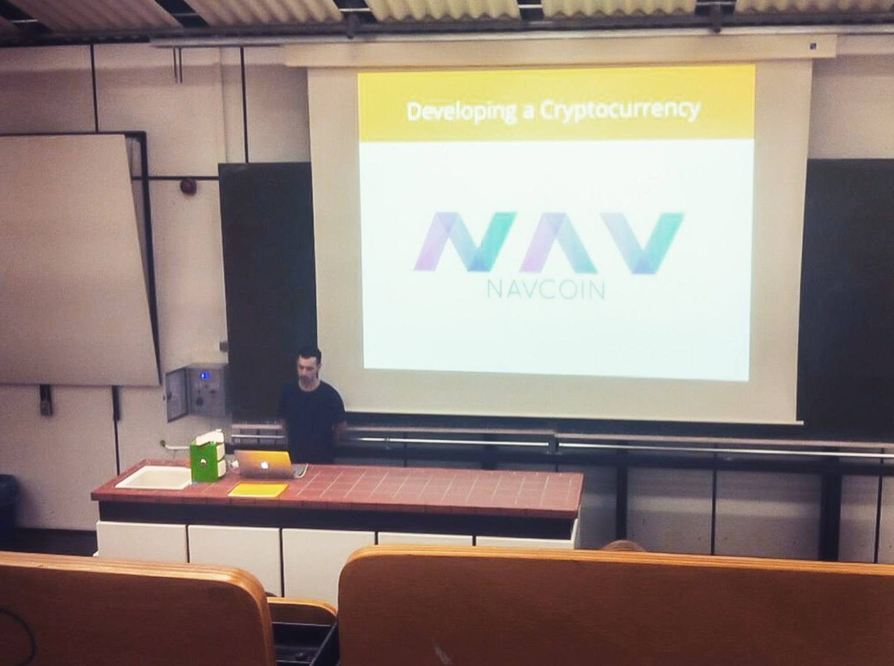

The NavCoin Core developers have a range of projects on the go in 2018, supporting the ‘big picture’ mission of simplifying cryptocurrency. 
<!--more-->

### 2018 Roadmap Is Live!
The roadmap linked to below outlines what’s coming over the next 12 months.

https://navcoin.org/project-roadmap

### NavPay & The iOS App Store
The NavCoin Core content creators would like to address the confusion in the community that was generated by the social post yesterday in regards to NavPay, Apple and the App store.

Last December, the NavPay App was rejected from the App Store due to some minor technical feedback. The NavCoin Core developers have since fixed all the technical issues Apple had with the application. There is currently only one outstanding item holding NavPay back from being listed in the App store – that NAV needs to be added to the approved digital currency list.

The NavCoin Core developers are in talks with Apple about getting NAV whitelisted. There are already quite a few digital currencies approved for iOS, so it is hopeful that this will be a speedy and relatively easy process, but NavPay is unfortunately still at the mercy of the App Store until this approval is secured.

If NAV can get approved for use on iOS, it means that NavPay can be listed in the store, and any iOS app will be able to use NAV in their app if they choose to adopt it. The NavCoin Core developers are doing their best to make this happen. Until NavPay is approved in the App Store, you can still use the NavPay web wallet on iOS devices. For an optimum experience, it’s recommended to use Chrome.

https://navpay.navcoin.org

### Alex Lecturing On Blockchain
Last week NavCoin Core developer  Alex, gave a lecture at the Beuth University of Applied Sciences in Berlin. Alex presented to large group of students on the basics of cryptocurrencies, NavCoin, and blockchain technology. The NavCoin Core developers believe education is hugely important in the cryptocurrency industry, and are excited to contribute to the spread of knowledge on both Blockchain and NavCoin.

### NavCoin Core Developer Processes & Scalability
With so many big projects in the pipeline, the NavCoin Core developers have been spending some time working on designing and implementing scalable development processes. The goal is to create robust development, build and deployment practices amongst the NavCoin Core developers.

That’s it from the NavCoin Core team this week.   

Talk Soon,
NavCoin Core Team.