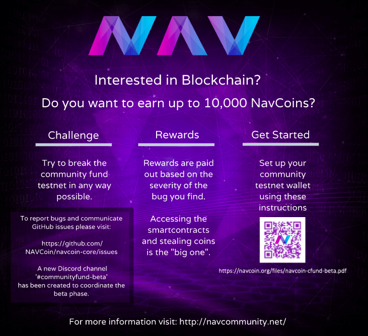

In this week’s report we have a new batch of NavPi’s, another new Software Engineer joins Encrypt S as a NavCoin contributor, and the new NavCoin Knowledge Base is now live.
<!--more-->

### NavCoin Knowledge Base
The new Knowledge Base platform is now live and expands the NavCoin community’s technical support resources. We hope this will become the go-to place if you have technical issues. It will also contain guides that will help you without needing to wait for someone else in the community to reply to your post.

https://info.navcoin.org

We’ve surveyed the moderators to find a list of the most common questions and problems they encounter. From this, we’ve seeded seventeen articles and guides as well as an updated FAQ, which we hope will allow NavCoin users to find the solution they’re looking for quickly. We are continuing to work closely with the community moderators and senior community members to help the NavCoin Core content creators write more articles that can be published to the Knowledge Base to fill in any gaps.

The Knowledge Base is a work in progress. If you can’t find the help you need here, then head over to the support channels on Discord where a moderator can help you directly. They will then write up your query as another article for the site.

### New NavPi batch available
The NavCoin Store has just released another batch of NavPi’s. Stock is limited to sixty for this batch so make sure you get in quick if you want to get your hands on one.

https://store.navcoin.org/product/navpi-stakebox

The NavPi’s are Raspberry Pi devices which come with the NavCoin wallet installed. With this you can contribute to transaction validation 24 hours a day without needing to have your laptop or computer running all the time. NavCoin uses Proof of Stake mining which consumes very little electricity and helps maintain the NavCoin network.

If you already own a Raspberry Pi, we also have the image available for download on our website if you wish to set this up yourself.

https://navcoin.org/downloads/#nav-pi

### Encrypt S Expansion and Structure
At the beginning of this week Mike Delucchi started working at Encrypt S in Auckland. Check out last weeks report to see his bio and skills. We are very pleased to have him working for Encrypt S as a key contributor to NavCoin projects.

https://www.linkedin.com/in/zanuka

Encrypt S has also hired another Senior Developer, Rowan Savage who starts tomorrow.

Rowan is a very talented Senior Developer who has previously worked in various roles with Craig MacGregor. Rowan has 10+ years full stack experience, specializing in complex front-end web applications. He’s a Javascript and UX Ninja, Urbex Enthusiast, React and Node specialist and is an Internationally recognized award-winning developer (2015 MobileWebAwards).

https://www.linkedin.com/in/savagerowan

With the number of NavCoin contributors growing, Encrypt S is now better placed than ever to continue their roadmapped projects. At this point it’s worth explaining who’s working on what so everyone can get an overview of how we plan to achieve their goals.

Paul Sanderson and Mike Delucchi are primarily focused of the NavPi 2.0 Kowhai project. These two are highly skilled full stack developers and technical leaders. Their secondary role is to define and implement advance development lifecycle processes. They are in charge of creating our replicable development environments, aligning build procedures and creating automated deployments across the NavCoin software range. Beyond these responsibilities, they are beginning to contribute to the NavCoin Community and are involved in our peer review and mentoring procedures across the wider NavCoin Core developer group.

Matt and Paul will be joined by Rowan Savage on the NavMorph project. As experienced JavaScript developers they will be working on updates for NavPay and various other web development projects and website maintenance. Beyond this, they are also beginning to contribute to NavCoin Core and are involved in our peer review procedures across the wider development group.

Alex Vasquez and Craig MacGregor continue as the technical leads at Encrypt S and are working hard to upskill NavCoin community developers to become effective contributors to the core project as well. Encrypt S is in talks with another Senior Application Developer to join the ranks and work primarily on NavCoin alongside Alex and Craig.

These initial projects are designed to introduce the new developers to NavCoin and blockchain. As software is completed and released, each group will then refocus on a new set of projects in the pipeline like NavChange, NavDelta and NavCoin Kauri. The intention is that a group has a primary project, but can also contribute to secondary and wider objectives in parallel.

### Bounty for the community fund
The NavCoin Core developers are looking for engineers to try and hack the proposed community fund! With the testnet now running, Alex is putting out the call for developers to help stress-test the fund, and find any bugs.

The community fund is part of the network consensus mechanism, so we all need be sure it to work as intended, and be a secure platform that can’t be taken advantage of.

Rewards will vary and are based on the severity of the bug found, with up to 10,000 NAV (currently worth around $18,000 USD) available for the highest severity bugs.

For more information, check out Spiritar3’s medium post.

https://medium.com/@spiritar333/navcoin-community-fund-testnet-5974c07f898b

You can visit the Bounty Program page here and get started today.

http://navcommunity.net/cfund-bounty

### Standout community members!
Special thanks to a few community members who have gone above and beyond with the amount of effort they put in.

Spiritar3 has been a big part of the NavCoin community for a while now, and recently helped set up the community marketing survey, which will assist the NavCoin Core contributors communicate and engage with the wider community better. Spiritar3’s also been involved in a recent community social media campaign, as well as helping to find users for the community fund testnet. Your efforts haven’t gone unnoticed!

Another community member that we would like to thank is sakdeniz, who has spent a good amount of time setting up the http://navcommunity.net website, and creating a promotional video for the project. These will go a long way to helping inform people about NavCoin. You deserve a huge thank you for your time and energy!

That’s it for the weekly report.

NavCoin Core team