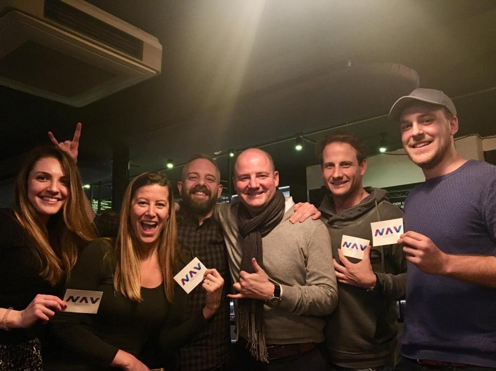

This week again there has been steady development progress across the main layer two applications which the NavCoin Core team are building on top of the NavCoin protocol.
<!--more-->

With the main APIs for the NavPi Kowhai project finished, Mike and Craig have spent some time planning the user interface to figure out how it will fit together. This includes planning out the primary user flow and the component usage for new Dashboard, Wallet, and Settings views. This user experience flow document will be published to the wider community next week as we make some final refinements on how we see the minimum viable software working.

Rowan and Matt have continued their work on NavMorph as they refine the existing code base, update it’s unit tests and plan the next phases of the project with Craig. Alongside NavMorph Rowan and Matt have also been making improvements to NavPay including adding alerts to notify the user if a new version is available, push notifications, QR scanning on Safari and preparing NavPay for use as a progressive web app. Having NavPay available as a progressive web app gives users more options for how they use NavPay on devices which are as yet unsupported by the bundled versions as we still grapple with iOS app store approval.

Paul and Alex have been focused on the NavCoin Go implementation which will allow for the Lightning Network and Atomic Swaps to be used on the NavCoin protocol. There is a bit of planning to be done in regards to how the code is kept up to date with upstream changes and potentially simplifying the number of navcoin-core codebases the NavCoin Core Team maintains.

Beyond NavCoin Go, Paul has been working to get a static NavCoin site up and running to provide an easier way for all NavCoin’s community members to have their projects and news published and represented. When completed, community members will be able to add and update content on the site by simply submitting a pull request with the changes to GitHub which will be tested and approved by community moderators.

### New NavCoin Contributors
NavCoin Engineer Craig MacGregor’s software development company Encrypt S has secured two new hires which will be contributing to NavCoin projects. Firstly John Darby, a Senior Digital Strategist with decades of experience at some of New Zealand’s top advertising agencies. John is an experienced technical copywriter, content strategist, video director and social media expert who will assist with a wide range of content creation and digital strategy across the projects the NavCoin Core team are involved in. His primary focus is to help craft the navcoin.org website, social posts, articles, video scripts, and white papers.

The second hire is Carter Xiao, an experienced UX/UI designer with a passion for cryptocurrencies and the social benefits they provide. Carter has years of design experience and a wide range of skills including 3D, motion graphics and web development. He will be focusing on fine tuning the user experience of projects like NavPay, NavPi and NavMorph as well as helping to create videos, infographics and social content that bring to life the NavCoin ethos of “Simplifying Cryptocurrency”.

## New NavCoin Community Website
A new NavCoin community website created by @SakDeniz has launched recently, where you can propose and vote for community funded projects, ask for support on the forum as well as view the wide range of community-led efforts. The NavCoin Core developers encourage all of the wider NavCoin community’s efforts to showcase and further develop NavCoin and it’s open-source ecosystem. Check it out!

http://navcommunity.net

## NavCoin Merchant Stickers
Are you a business and that accepts NavCoin? “NavCoin accepted here” stickers by Eldar are now available for order through the RedBubble merchandise site!

https://www.redbubble.com/people/eldar/works/30219500-navcoin-accepted-here?asc=u&p=sticker

## London Community Meetup
The NavCoin Community Meetup in London was a success with fellow NavCoiner’s getting to know each other and talk all things NavCoin. Check out this great picture from the evening.

Special thanks to Spiritar3 for putting this community event on.

## Upcoming Netherlands Meetup
NavCoin community member Jonathan, is hosting a NavCoin meet up in the Netherlands in early May. If you are interested in going to this event please fill out this form to help him formalise the details.

https://goo.gl/forms/DqfzvyXQaCOjJygF2

That’s the community news report for this week.

Talk Soon,
NavCoin Core Team