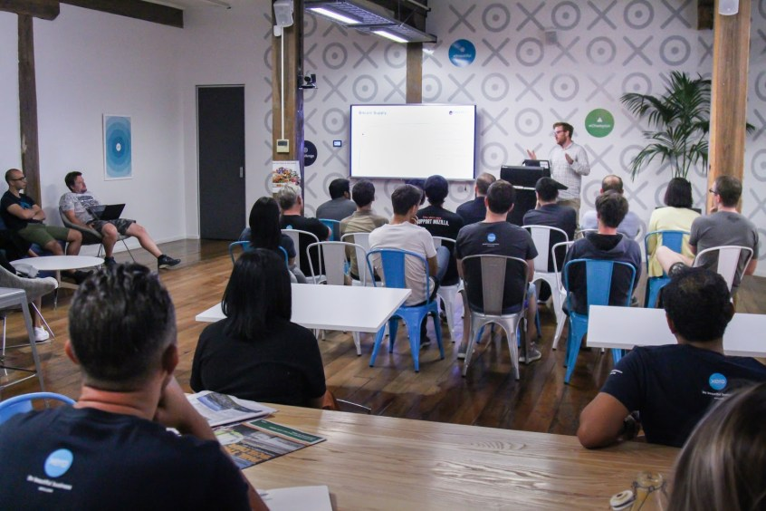

The NavCore team and NavCoin community continue to make development progress on the roadmapped features. The NavCoin website is set for a refresh as well as additional informative content in support of existing projects.
<!--more-->

### Development Update
There’s been lots of development progress across the board this week by NavCore and the wider NavCoin community.

The NavCore team have been working closely with the wider community to support their development efforts in building NavCoin applications. The NavCoin Core Docker image has been added to the NavCoin repositories to make it even easier for anyone wanting to build on top of NavCoin. Sakdeniz has continued to make progress on the NavCoinVue project which can be viewed on the NavCommunity site.

http://navcoin-vue.navcommunity.net

Alex and Paul have begun working to port the Go implementation of Bitcoin for use with NavCoin. This is the first stage of implementing the lightning network for NavCoin and as such this project has been moved from Upcoming to In Progress on the project roadmap.

https://navcoin.org/project-roadmap

The NavCore team have spent some time this week planning the NavPi Kowhai user interface as most of the backend API’s are nearing completion and this project is nearly ready to move onto its second phase. The test coverage has been increased on the back end and the docker workflow has also been refined.

The TeDiCross bot has been re-enabled to bridge NavCoin’s Telegram and Discord communities. Posts on Discord’s general channel are now relayed to Telegram and vice versa. A new translation plugin has been implemented on the NavCoin website. This allows us to more easily separate the content from the site’s design and involve community members in keeping the translations up to date. We’re starting with the Español translation then will be re-enabling more language translations over the coming weeks as they are ready.

Behind the scenes NavCore have been working with @mntyfrsh to upgrade the infrastructure which runs the NavPay backend so it can scale efficiently as more users are onboarded. Working to align and scale existing infrastructure maintained by the NavCore team is a top priority for the team and this is the first step in that process.

## Third introduction article on Valence
This week, the NavCore team is putting the finishing touches on the final article in the Valence introduction series. The goal of this series is to explain NavCore’s vision for Valence, how it came about, and how it benefits NavCoin.

If you haven’t read the first two articles in the series, make sure you check them out.

https://navcoin.org/news/welcome-to-valence

https://navcoin.org/news/building-a-stronger-better-navcoin

It will take us some time to communicate the entire scope of Valence, due to the complex nature of the project. We are grateful for your patience as we continue to work on finding the best ways to communicate this exciting project.

## Website Refresh in Progress
The NavCore Content team is moving its focus towards restructuring navcoin.org website. The aim is to provide more standalone resources on all of the projects and technologies, as well as refreshing the existing content.

The goal of this exercise is to create a finely tuned user experience for new visitors as well as adding in more detailed content for those who want to know more about NavCoin.

## Community Contributions
iFaq has made a stellar effort this week contributing multiple articles to the NavCoin Knowledge Base. So far the Knowledge Base has been serving the community well as a technical support resource. If you can’t find the help you need here, then head over to the support channels on Discord where our community can help you.

Kirk Dunkley, more commonly know on Twitter as @sigma_six_ has released a limited edition NavCoin sculpture in his coin sculpture series. The series was created to engage with the cryptocurrency community in a meaningful way, and introduce the art collectors in this space to his online gallery. Browse his online store to purchase your NAV sculpture.

http://www.sigmasixdesign.com/bitcoingallery-store#!/The-Simplifier-NAV/p/102127036

One of NavCoin’s community members, Sakdeniz has created a video explaining NavCoin and spotlighting it’s features.

https://www.youtube.com/watch?v=Jz62CXljDVk&feature=youtu.be

## Xero Presentation
NavCoin Core Software Engineer, Craig MacGregor gave a presentation at Xero's Auckland office yesterday. His talk was geared towards introducing people to the basics of Bitcoin and blockchain technology. It covered blockchain’s distributed rather than centralized architecture, how transaction data is shared across the network and the emergent benefits that come from this approach. He also covered the fundamentals of Bitcoin’s supply, demand and the blockchain tech company landscape.

Thanks again to the NavCoin community and their efforts to raise awareness of the NavCoin project and its goals. We will continue to keep you updated about projects and events throughout the NavCoin community. Don’t forget it’s all open source so you can follow along on GitHub and more importantly get involved.

Talk Soon,

NavCore Team