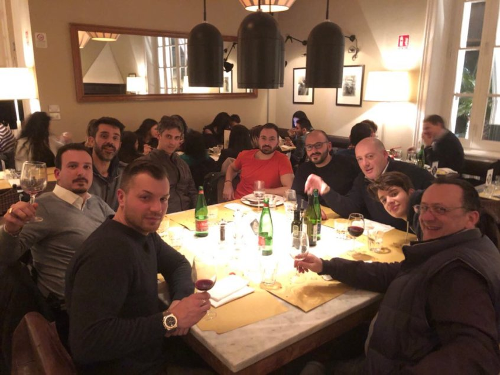

This week saw Alex pass his years of blockchain experience onto developers Mike, Paul and Matt in order to upskill them on the advanced parts of NavCoin core. 
<!--more-->

Their work together over the past few days has shown that even though people in the NavCoin community might live in different hemispheres, it’s still possible to work together and learn from each other – which is what a community is all about.

### Developer Updates
So with that in mind, let’s check in with what developers in the NavCoin community been doing since the last weekly update.

Mike, Paul and Craig have been spending much of their time collaborating on the NavCoin community website and testing the NavCoin community fund. Mike and Paul have also been applying themselves to NavPi 2.0 development.

Along with everything he’s been doing to help other members of the NavCoin community, Alex has continued writing the cold staking implementation for NavCoin, which is now in the testing phase. For those of you who are unfamiliar with the term, cold staking is a way to add extra protection to your coins while still staking the network. It allows users to stake the network with a ‘hot’ wallet (connected to the internet e.g. your NavPi), while protecting your coins in a cold/paper wallet – which is a wallet that’s not connected to the internet.

Cold Staking has been moved from ‘proposed’ to ‘in progress’ and is expected to be completed for the next major version release of NavCoin Core. For updates on the progress of these projects and the other community development efforts check out the Community Roadmap.

https://navcoin.org/community-roadmap

Even though we are still waiting to hear back from Apple, NavPay is being developed and improved upon. Rowan is currently involved in upgrading NavPay to work as a Progressive Web App with offline use on iOS 11.3.

### Community Webiste Content
The content team have been busy scoping and developing the NavCoin community website. It will become a hub for everyone who wants to contribute to NavCoin – from expert developers to people who just want to become more familiar with NavCoin and all the related projects by community members all over the world. Something like this is always a big undertaking, so look out for more news over the coming weeks.

As ever, the community have been involved in a range of interesting projects and contributions to NavCoin. The beauty of open source in general and the NavCoin community in particular is that contributions are genuinely welcome from anyone. There are members getting involved by contributing and showing support from places as diverse as Scandinavia, Asia and the USA – all sharing their input for the greater good of the project.

### Meetup In Rome
There was another community meetup last week this time in Rome, Italy. It’s great to see the community coming together to get to know each other!

Well that’s it for another super busy week. See you next time.

NavCoin Core Team