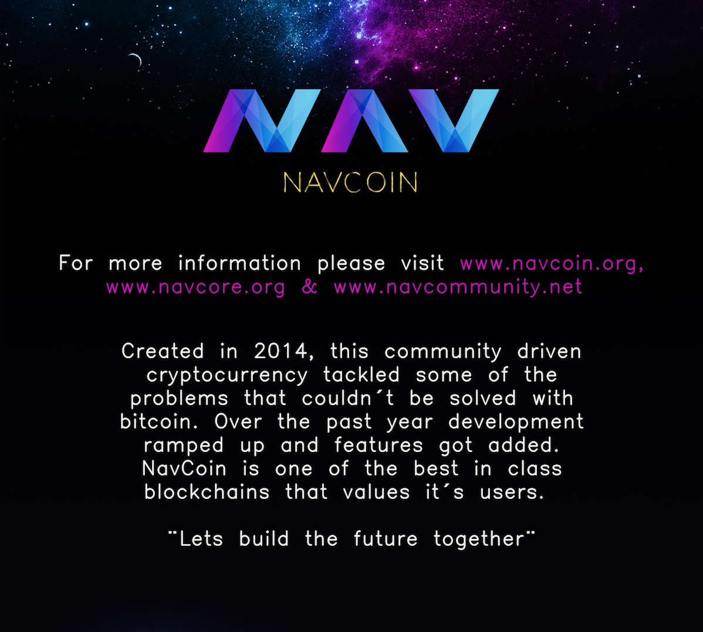
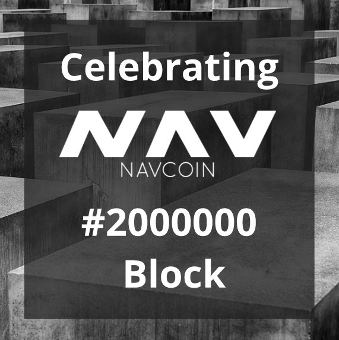

There has been a lot more activity within the NavCoin community over the past few weeks. More and more people are getting involved and contributing their own ideas and projects — which is exactly as it should be. NavCoin is a free community that no one owns or controls. It's up to you to help make it a thriving environment for anyone who is passionate about blockchain technology. You don't have to ask anyone's permission — just do it!
<!-- more -->
With that in mind, let's take a look at some of things that happened in the global NavCoin community over the past seven days.

### What's happening in the community
Harmonious_solutions (on Discord) is giving a presentation at his university in Texas on blockchain and NavCoin. His goal is to educate his audience and encourage them to engage with blockchain communities like this one. Want to go along? Look out for more information on Reddit, Twitter and Discord.

Zalmiac (on Discord) has created this infographic, which expresses the key attributes of NavCoin. Check the full version out here.

https://cdn.discordapp.com/attachments/372198238637260800/437905184429965322/image.jpg

Over on Reddit, community contributor Kastelkannu has posted about his plan to create some NavCoin video content. He needs other community members to help him by lending their faces, voices or both. For information on how to get involved with this project check out Kastelkannu's post on Reddit here.

https://www.reddit.com/r/NavCoin/comments/8dijx3/id_like_to_make_a_promotional_video_i_need

Italian community member Simone Da Re (@DareSimone on Twitter), who is also the co-founder of Coiners (@coiners_it), gave this presentation during a blockchain meetup in Verona, Italy. He talked his audience through blockchain technology with specific reference to the NavCoin ecosystem. You can check out pictures from the event here https://twitter.com/__fevr/status/987231718661939201
 
<section style="text-align: center">

  
</section>

A few days ago, the two millionth block was validated on the NavCoin blockchain. This significant milestone could only be achieved with the continued support of the NavCoin community!

 
<section style="text-align: center">

  
<i>Image made by Spiritar3</i>
 
</section>

### Developer updates
As usual Alex has been going hard on the long list of items on his todo list.

- Added a new devnet for NavCoin. Using this, the NavCoin core dev team and the wider community will be able to test experimental functionality before rolling out the changes to the testnet, which will lead to more thoroughly tested code changes.
- Fixed a bug where cold staking address balances were not tracked when txindex or addressindex was activated in the wallet.
- On the clocksync branch, nodes which are not synced to an ntp server are now rejected from the network.
- Added functionality to bootstrap directly from the wallet. Bootstrapping is where a user downloads the blockchain from an external source to speed up the sync process. Before that the user had to manually download and extract it on the system data folder. Alex has integrated the functionality so now it's done automatically by the wallet when requested.

As always Paul has been contributing to many different projects, but his main focus last week was working with Alex on building a new devnet to enable much faster experimental testing by scaling to hundreds of nodes automatically.

Rowan has continued working on the NavPay update and the new NavPay hosting solution. There will be more information on this update soon.

Matt has spent time on the NavCoin Paper Wallet to make it more user friendly. Matt has also continued his contribution to the new NavPay release, adding translations to NavPay and a new backend server api for our distributed databases to use.

Craig's week was one of many meetings, contributing to a range of projects currently in development by different members of the NavCoin community. It was also his birthday week, so he also made sure to enjoy some quality time with his family and friends.

The projects page on the NavCore website has had a refresh, now with sorting by project categories and a more visually appealing design.

https://www.navhub.org/projects

If you're working on your ownNavCoin project, you can add it to this page (and the roadmap) by following the instructions on the NavCore GitHub.

### Content and media.
The content contributors continued work on the developer and content contributors manifestos, and producing a style guide for NavCoin.

As it is every week the Community News was a key focus as well. And that's somewhere you can help too. Anyone can publish news about their project, meet up, marketing initiative or anything NavCoin related to the NavCore website. All you need to do is follow the guide on the NavCore GitHub to add your own content. The NavCoin Core Media Collective are working on creating tutorials and guide to make this process easier for all community members.

### Meet the newest member of the NavCoin community.
Syd is the latest high profile addition to the NavCoin core team this week, and has already shown that he has a taste for the latest blockchain technology (no NavPi's were harmed in the making of this photo).

That's all for this week,

NavCoin Core
