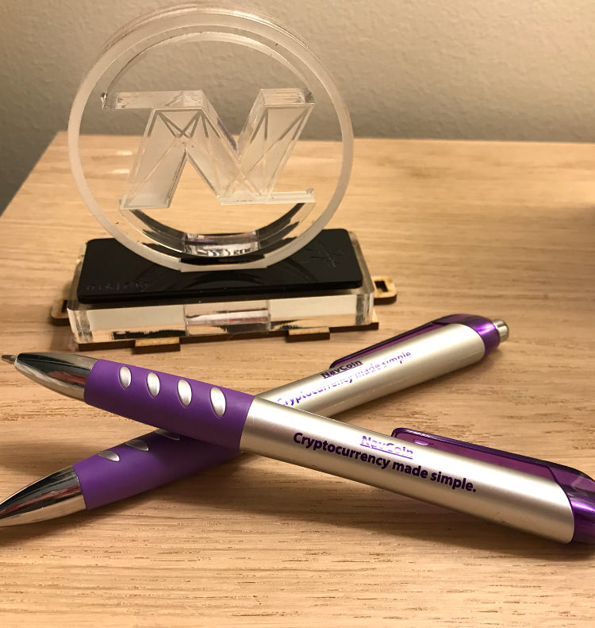

Last week was all go for Nav community developers as they crammed five days work into four before taking Friday off for the Easter holiday. Alex was in New Zealand on a flying visit and caught up with some of the locals who were keen to get the benefit of his wisdom and experience on all things blockchain. The new NavCoin community hub at navcore.org has been launched and the navcoin.org website reorganized.
<!--more-->
### NavCore.org the new NavCoin Community Hub.

The NavCoin Community Hub is brand new space to showcase what’s going on in the NavCoin Community and its wide range of projects. The Community Hub is statically rendered directly from the project files, which are publicly available on the NavCoin GitHub. By running the site in this way, anyone can directly suggest changes or create content - which then is subject to approval by a group of reviewers. It’s decentralization in action, and will help NavCoin become an even more vibrant and creative community. The Community Hub will become like a collective publication for NavCoin news, project information, resource links, merchant listings and the community roadmap. If you want to add any of these things, all you have to do is follow the instructions on the website and GitHub.

The NavCoin Core team will be publishing more information and tutorials over the coming weeks to help make the contribution process as easy as possible.

https://www.navcore.org

With the introduction of the Community Hub, the content on the original NavCoin.org site has been trimmed down and refocused towards the NavCoin Core software and protocol. There are links to all the community sites (Community Hub, NavTech Servers & NavCommunity) in the main menu, so it’s still easy to find the information you want.

The NavCoin.org website is also in the process of being migrated to a statically rendered site running off the NavCoin GitHub to allow for easier collaboration. Once migrated, a new documentation section for the NavCoin Core protocol will be added to the site. There’ll also be a NavCoin Improvement Proposal section, which will allow developers to post technical documents on proposed changes to the protocol for debate and review.

https://navcoin.org

### Developer Updates
Mike’s main focus has been NavPi. Here’s what he checked off his todo list:

- Planning NavPi Kowhai UI stories
- Start work on NavPi Kowhai UI
- Feature dev on NavPi Kowhai API
- Peer review on NavPay

Rowan’s had a big week too, with all his time taken up with making improvements to NavPay, including:

- Adding custom NavTech servers to NavPay
- Enhancing NavPay UX for security and encryption

Despite coming down with a nasty cold Paul still managed to get through a decent amount of work last week. He was a major contributor to the rebuild of the community site, along with testing of the community fund and cold staking implementation, as well as working with Mike on some of the NavPi development.

Matt has started working to migrate the NavCoin.org website to a static site using the new Community Hub site as a base.  

The NavCoin Vue wallet project lead by Sakdeniz has been renamed NavCoin Next. You can view the current progress of the project on the NavCommunity site.

http://next.navcommunity.net

### Alex’s visit to Auckland
Although he wasn’t in town for long Alex made a big impression on the Kiwi developers he met. Alex is an exceptional talent and a wonderful ambassador for blockchain. He spent a lot of his time in NZ with the newer NavCoin Core contributors to help accelerate their knowledge of blockchain and the NavCoin Core software so they can become more effective contributors to the project.

 
<section style="text-align: center">

  
</section>

### NavCoin Pen Giveaway
Reddit user mexicanrunbird is kindly giving away NavCoin branded pens to the community. The idea is for community members who receive the pens to give them away to friends and family to encourage awareness of NavCoin. This is a great example of community members thinking outside the box and making an effort to get involved in this project in a creative way.

https://www.reddit.com/r/NavCoin/comments/89i0pe/nav_giveaway_free_pens_to_all_the_navcoin/

### Upcoming Content
The NavCoin Core Developers are working hard to complete the testing of the Community Fund. When it’s accepted onto the mainnet, any community contributor will be able to submit proposals to claim funds - giving them access to decentralised, democratised funding for their projects. Members of the content team have started creating in-depth guides to help explain how it works, and step-by-step guides to show community members how to get involved.

That’s all from us this week,

NavCoin Core
