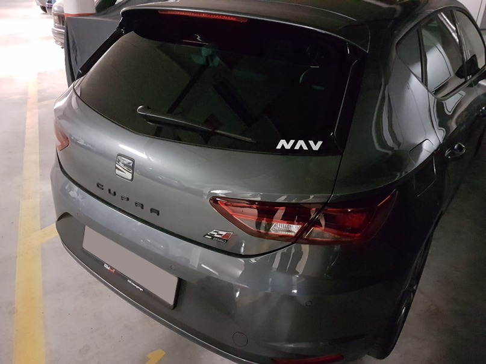

You might have noticed that the NavCoin Community News has been getting longer and longer recently. There’s a lot to share with you, and as you’ll see it’s not just developers who are making impressive contributions. The beauty of the NavCoin community is that everyone can participate, and you don’t need to be tech-guru. Last week we heard about someone giving out NavCoin pens and this week there’s another example of a code-free NavCoin community initiative.
<!--more-->
### Developer updates

Rowan has been busy getting the next version of NavPay ready for release (in the next few weeks), and this week he has deployed NavPay servers to test new infrastructure, and helping out community member @mntyfrsh (on Discord), who last week made another massive contribution:

- Deployed NavPay to AWS dev environment
- Tested NavPay deployment in new environment
- Increase security of NavPay servers
- Added multiple clusters and backups for NavPay Servers, including multiple regions

Matt also had a big NavPay week. All the text that’s been added to the new version has been translated into Spanish, Russian, Italian, Japanese, Dutch, German, and Portuguese.
Matt sends grateful shout-outs to the NavCoin Italian community, Vlad, Ras, Toffeeapple, and the many others who contributed anonymously - it couldn’t have been done without you.

Paul had to spread himself around, assisting Alex and Craig on the staking difficulty bug patch, helping Craig plan APIs for future crypto wallets, and on-boarding Carter - who’ll you meet in more detail below. Along with all that, Paul started development of a system to roll out a scalable NavCoin testnet of 100's of servers.

Last week was another big one for Alex too, as he burned the midnight oil working on the difficulty bug patch. He has submitted the fix as a pull request on GitHub, which is awaiting review and approval by other core developers. Alex continued his Cold Staking project, and set up to upload the bootstrap to the new DigitalOcean servers.

As usual Craig seemed to be everywhere in the NavCoin community at once, collaborating with Alex and Paul on their projects, and setting up a testnet block explorer. He also planned content for the NavCoin and NavCore websites, and collated ideas that community members have contributed the NavCoin Developer and Content/Media manifestos.

Mike enjoyed some fun family time with his in-laws visiting from the US, but he was still able to add functionality to NavPi Kowhai UI.

### Content and media.

The Auckland based content contributors spent lots of time in meetings and brainstorming last week - where the main focus was on refining upcoming projects, and streamlining regular workflow. In the coming weeks they will be creating a library of technical information that will be available on the new NavCore Community Hub, which includes clear instructions on how anyone can contribute to the NavCoin static websites.

### A big welcome to Carter.

The latest member of the NavCoin Core content collective is Carter Xiao, who has started at Encrypt S as lead designer. Among other projects at Encrypt S he will be sponsored to contribute his skills in UX, digital graphics and animation to NavCoin.
Community efforts

NavCoin Merchandise! New NavCoin merchandise is on the way. Starting with T-shirts, hoodies and hats. The range will be available in the Always Hodl online store within the next few weeks. https://alwayshodl.com/collections/hodl

### Community inspiration

@Siflu (on discord) has created this NavCoin car sticker, which you can find here.

https://www.reddit.com/r/NavCoin/comments/8c6ajo/increase_awareness_with_these_car_window_stickers/

Honk if you heart NavCoin!

This is another example of a community member using their initiative to spread the word about NavCoin - with not a line of code in sight! What ideas like this could you come up with?

That’s all for this week,

NavCoin Core
