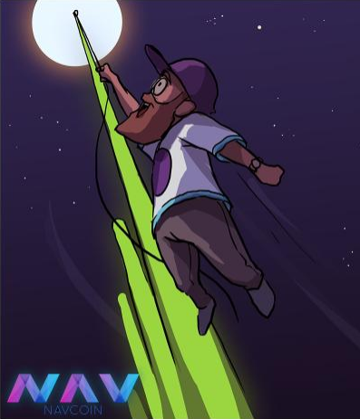
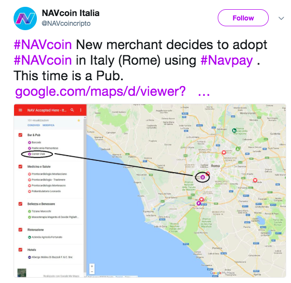

This week brings the opportunity for the whole community to get involved in and informed about the upcoming soft fork in NavCoin 4.2.0 - which will kick off the Community Fund accumulation. And as usual there are exciting community initiatives to inspire you, and news of incoming work by the Core Content contributors.
<!-- more -->

This week brings the opportunity for the whole community to get involved in and informed about the upcoming soft fork in NavCoin 4.2.0 - which will kick off the Community Fund accumulation. And as usual there are exciting community initiatives to inspire you, and news of incoming work by the Core Content contributors.

### What's happening in the community

Sakdeniz has created yet another amazing video to promote the world of NavCoin. Watch it on Youtube with this link below: https://www.youtube.com/watch?v=M0-YifzLnhs

 
<iframe width="100%" height="315" src="https://www.youtube.com/embed/M0-YifzLnhs" frameborder="0" allow="autoplay; encrypted-media" allowfullscreen></iframe>
  

And here's some more fun from Beekart.

 
<section style="text-align: center">

  
</section>

Cheers to NavCoin Italia for adding another merchant to the NavCoin roster. You can view the new merchants on their interactive “NAV accepted here” Google map.

 
<section style="text-align: center">

  
</section>

https://twitter.com/NAVcoincripto/status/997227630016548864

### Technical updates

The release candidate of NavCoin Core 4.2.0 is ready for anyone to review and comment on the source code in GitHub. This is an important update that proposes a soft fork which enables accumulation of NAV in the Community Fund and fixes the Time Warp bug.

Since NavCoin is an open source community project with various contributors the NavCoin Core developers have recently enacted a policy to publish "release candidates" prior to any consensus changes. This is to provide fair opportunity for any interested party to review the code before it's officially released to the wider public.

If you would like to review the code for the proposed NavCoin 4.2.0 soft fork, the pull request into the master branch can be viewed here:

https://github.com/NAVCoin/navcoin-core/pull/209

There's also release candidate binaries available for testing here:

https://build.nav.community/v4.2.0-rc

For more information on what this update includes, and how it affects NavCoin going forward, we highly recommend you read the post about it here:

https://navhub.org/news/2018/05/navcoin-core-4.2.0-release-candidate

The NavCoin.org static site has now been launched. The difference you'll notice immediately is that the entire site has had a comprehensive user interface (UI) makeover, modernising its appearance and making navigation easier. A consistent design style has been applied to icons, and text blocks have been cleaned up to enhance readability. The main benefit of converting NavCoin.org to a static site is that it's much more decentralised. Instead of running on a centralized Wordpress database, all the code is managed through GitHub. This also makes it easier for community members to contribute and review content via pull requests on GitHub.

The alpha version of prodpeak's block explorer is now live. What does this do? A block explorer is a website that provides detailed information about NavCoin blocks, addresses, and transactions. So as an example, it can be used as a source of truth if you want to see if a transaction has been successfully sent through the network. You can check it out here:

http://alpha.navexplorer.com

Hash512 (on Discord) is been making updates to the NavCoin M8 stakebox project. It's a lower-cost alternative to the NavPi, but with extra computing power. For more info and to join the NavCoin M8 Discord channel visit:

https://www.navcoinm8.com  

 
<section style="text-align: center">

  
</section>

### Content and media

After plenty of discussion the Developer and Content manifestos have made it through peer review and are currently getting ready for publication. Keep an eye out on the usual social channels over the coming week for info on where to find them.

Have you seen the NavCoin Brand Guidelines yet? Since NavCoin's design is public and everyone can be a valuable contributor, the idea behind the Brand Guideline is to help the community get on the same page in terms of typography, logos, images and writing style. They're a good place to start if you want to create your own websites or promotional material for NavCoin or NavCoin projects you're working on. Here's the download link:

https://navhub.org/get-involved/#brand-bible

That's all for this week,
NavCoin Core
