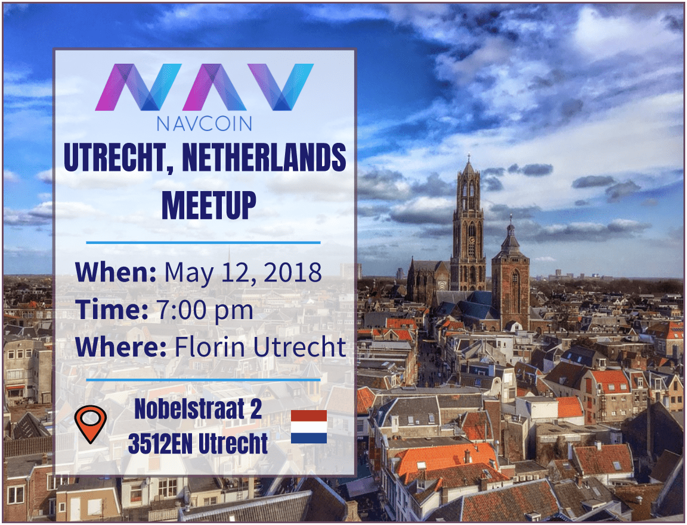
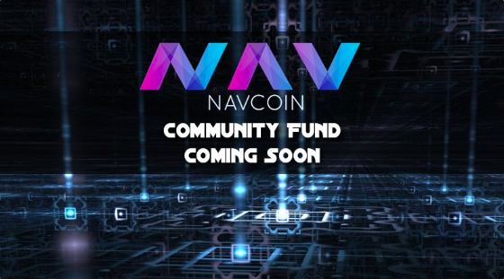
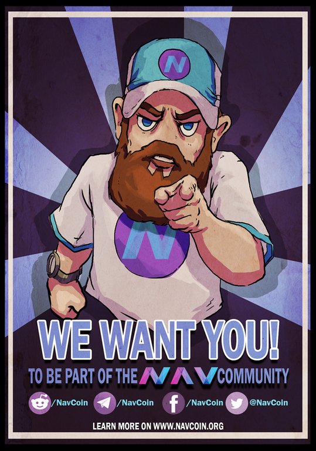
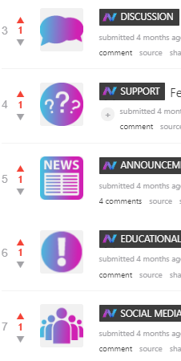
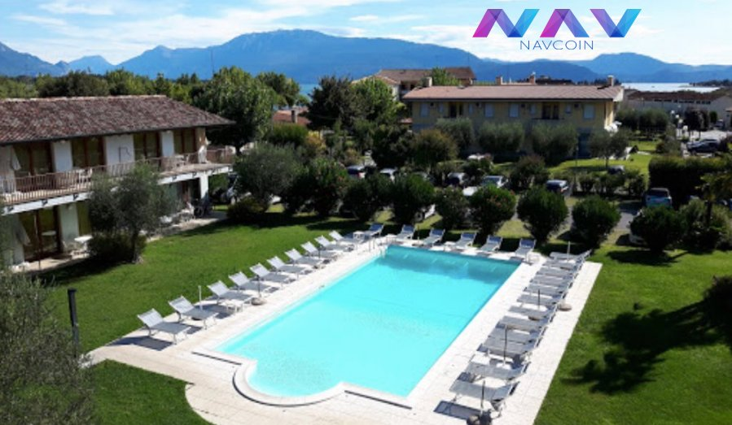
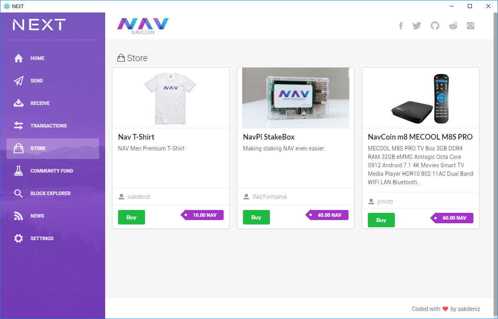

The NavCoin community is on a roll at the moment. The social channels have been full of positive conversations and great initiatives keep on coming through. And not to be out done, NavCoin developers around the world have be hard at work on a range of interesting projects.
<!--more-->
### What's happening in the community
If you’re in the Netherlands you still have time to make the meetup in Utrecht this Saturday evening, which will be hosted at Florin Utrecht at 7pm. If you’re going, make sure to tag your photos #NavCoin so the community can share the experience with you. 
 
<section style="text-align: center">

  
</section>

ElyssanLol posted this striking promo graphic for the upcoming Community Fund on Twitter.
 
<section style="text-align: center">

  
</section>

Beekart (on Discord) is super imaginative as usual and came up with this awesome community recruitment poster.
 
<section style="text-align: center">

  
</section>

Jonathan (on Discord) revealed his first thoughts on some new flair based icons for the NavCoin Reddit page. It’s a nice use of the NavCoin colour palate.
 
<section style="text-align: center">

  
</section>

Meanwhile the powerhouse that is NavCoin Italia has added yet another high-end NavCoin merchant. This time it’s a luxury hotel near Lake Garda. What a fantastic place to spend some NAV.
 
<section style="text-align: center">

  
</section>

https://twitter.com/NAVcoincripto/status/990999660578865154

### Technical updates

The devnet went through its own testing and is now operational. Essentially, this devnet mimics the live blockchain environment - with ‘test’ nodes located around the world. But because it uses its own version of the NavCoin blockchain it will allow us throw everything at it and stretch it far beyond its capacity - which will give valuable insights into how the mainnet can be improved. 

Also this week the final touches were put on the NavPay 4.1 release. A deployment issue was detected early this morning, but we are hopeful NavPay will be rolled out to production once this issue has been resolved.

The new version of the paper wallet it out too. It’s a cheap, easy way to safely store your NavCoin offline. You can find the release notes at GitHub here.

https://github.com/Encrypt-S/paper-wallet/releases/tag/1.0.2

A tool has been created to monitor certain parameters in the blockchain like blocktime and difficulty, which will be useful in testing the timewarp patch.
Work started on a patch to speed up sync process, making the wallet look up for transactions in the coins database instead of reading it from raw blocks on disk. And work continued on the btcd port to enable lightning network and atomic swaps.

Sakdeniz (on Discord) has teased the UI design for the store section of the NavCoin Next wallet, which is currently in development. You can keep up to date with this project at http://next.navcommunity.net/.
  
<section style="text-align: center">

  
</section>

The downloads page on the NavCoin website (https://navcoin.org/downloads/) has been updated to include quick links to all the wallet downloads that are currently available. 

### Content and media.
The NavCoin Core Media Collective have been hard at work preparing new material that will be available soon. Last week the focus was creating content for the refreshed developer and community websites, and polishing the NavCoin brand bible and contributor manifestos. Once the brand bible is ready it will be available on the Community Hub website. 

It’s been suggested that the Community Hub currently at NavHub.org needs a new URL to avoid potential confusion between it and the developer website at NavCoin.org
Spiritar3 has created a survey to find the new URL. Check out the link below for more information:
https://www.reddit.com/r/NavCoin/comments/8g8dum/renaming_navcoreorg_what_suggestions_do_you_have/

NavCoin merchandise is almost ready to go on Alwayshodl.com and at the NavCoin Merch Store. Standby for an announcement of the launch date on Twitter and Facebook.

Last of all, sympathy to Mike, NavCoin Core developer who took a nasty fall off his bike on Monday on his way to work, smashing up his shoulder and breaking his arm. Super painful! He’ll be away recuperating for the next few weeks. Get well soon mate.

That’s all for this week,

NavCoin Core
