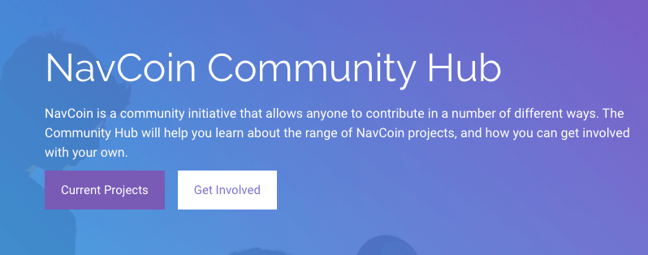
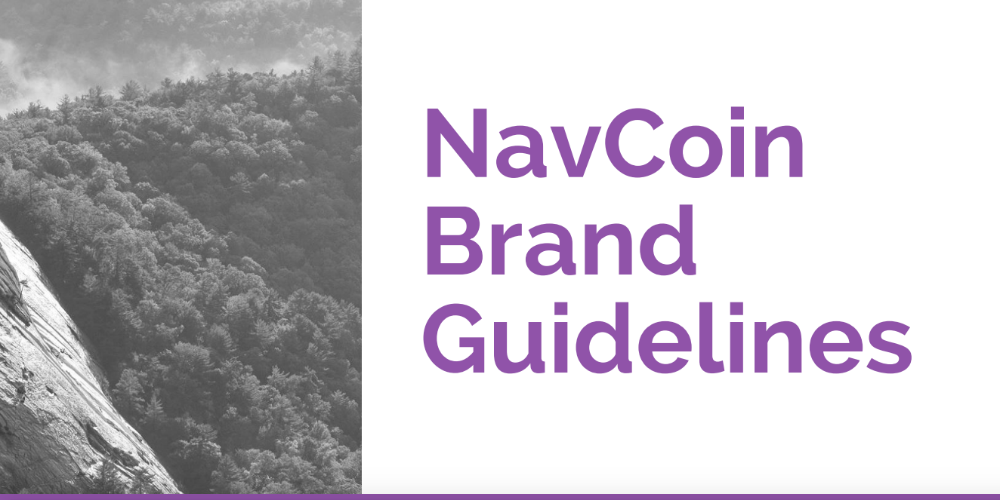

A major focus of the past few weeks for NavCoin Core has been creating a range of tools and resources to empower the NavCoin community to be confident contributors within the NavCoin ecosystem.

<!--more-->
A major focus of the past few weeks for NavCoin Core has been creating a range of tools and resources to empower the NavCoin community to be confident contributors within the NavCoin ecosystem.

* The "Get Involved" page on the NavHub website has been redesigned, and a set of brand guidelines have been released.  
* Developer and Content Creator manifestos that clarify roles and responsibilities are almost ready to share.
* Guides for onboarding merchants and charities will be available soon.
* Work is progressing on better developer documentation for the NavCoin protocol.
* The Community Fund launches in the near future.

### What’s happening in the community

It’s the Sakdeniz show this week. He created these awesome animations using Windows Movie Maker, and is happy for everyone in the NavCoin community to use them on social media. Click the ‘Share’ tab under the video player window to get an embeddable link to the video. Check them out and be inspired.

https://www.youtube.com/watch?v=U14Jh3WyENM

https://www.youtube.com/watch?v=IRRE6wgEDHo

https://www.youtube.com/watch?v=QV0l_Jhvb2g

https://www.youtube.com/watch?v=61LKu0thjFM

The Netherlands meetup was held on Saturday in Utrecht. Well done to all the community members involved for making this community initiative happen.
  
<section style="text-align: center">

  
</section>

### Technical updates

NavPay version 4.1 has now been released. After a last minute refinement to ensure the release went smoothly, the new wallet is ready to download. Read more about at the blog post here:

https://navhub.org/news/2018/05/navpay-release

or download it here:

https://navcoin.org/navpay

The NavCoin Core protocol 4.2 is almost ready to go. This is a big update which kicks off the community fund accumulation amongst other things, so look out for a blog post in the near future which will outline the key changes you need to be aware of.

Helping curate the NavHub website can be complicated if you’ve never used GitHub before. A step by step tutorial on how to use GitHub and contribute content to the NavHub site is nearly ready to go, and a new content management system (CMS) for the NavHub site is being created. The CMS is based on GitHub and makes it easy for anyone to add articles to the News section without having to install development tools.

We’re close to releasing a redesign of NavCoin.org as a static site so the community can contribute to it also. As part of the redesign process the full wallet downloads laundry list has been added back to the "All Downloads" page on the NavCoin website.

https://navcoin.org/downloads

The new NavCoin Paper Wallet version was added to paper.navcoin.org. A Paper Wallet is great option for cold storage offline or giving NavCoin as a gift. You can view the links to the paper wallets on the downloads page below.

https://navcoin.org/downloads/#paper-wallet

### Content and media
After input from numerous community members the new community website domain name has been selected. The new URL is navhub.org and it’s hoped that this will help remove confusion between NavHub’s community purpose and the more technical, developer focused website at navcoin.org
  
<section style="text-align: center">

  
</section>

The NavCoin core content creators also released their brand guidelines this week. It’s aimed at enabling the community to create their own NavCoin marketing material. It’s full of useful tips and examples to make it easier to create a consistent look and feel for your work on NavCoin, without needing to reinvent the wheel. The next stage for this is to build an asset library to house marketing assets, that anyone can contribute to. By making all them simple to find, it will be easier than ever to share and post about NavCoin on social media.
  
<section style="text-align: center">

  
</section>

You can download the brand bible pdf here:

https://navhub.org/get-involved/#brand-bible

That’s all for this week,
NavCoin Core
